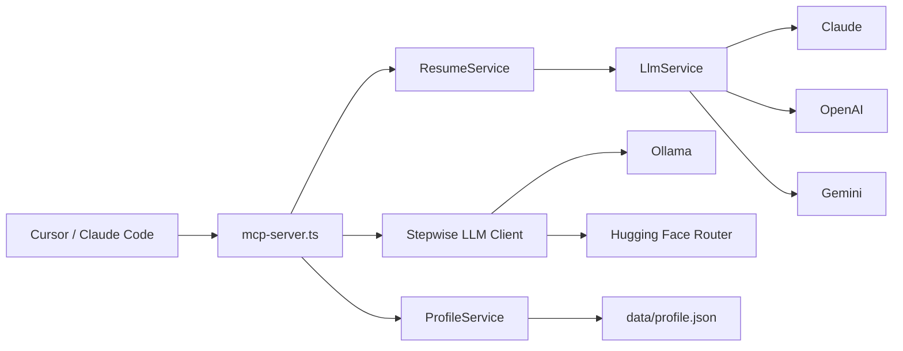

# IT-Resume-MCP

채용 공고(JD)를 입력하면 개인 프로필을 바탕으로 이력서, 포트폴리오 요약본, 자기소개서 초안을 생성하는 로컬 MCP 서버입니다. NestJS 위에 MCP 서버를 올리고, Cloud LLM fallback과 Ollama 기반 Local LLM 파이프라인을 함께 두는 구조입니다.

포트폴리오 관점에서는 "개인 프로필 JSON을 단일 소스로 관리하고, JD 분석 → 프로필 매칭 → 문서 생성으로 분리된 파이프라인을 MCP tool로 노출했다"는 점이 핵심입니다.

## 현재 상태

- 앱 코드는 `public-resume-mcp/` 아래에 있습니다.
- 2026-04-26 기준 로컬에서 `npm test -- --runInBand`, `npm run build` 통과를 확인했습니다.
- 주 사용 엔트리포인트는 `public-resume-mcp/src/mcp-server.ts` 입니다.
- HTTP API(`src/main.ts`)도 존재하지만, 이 프로젝트의 핵심 사용 시나리오는 MCP 연동입니다.
- 로컬 `origin`은 `git@github.com:doyeonjeong/IT-Resume-MCP.git`로 맞춰졌습니다.

## 저장소 구조

```text
.
├── README.md
├── DEV-PLAN.md
└── public-resume-mcp/
    ├── src/
    │   ├── mcp-server.ts
    │   ├── main.ts
    │   ├── llm/
    │   ├── profile/
    │   ├── resume/
    │   └── utils/
    ├── data/
    │   └── profile.example.json
    ├── documents/
    ├── docs/
    └── package.json
```

## 핵심 기능

- `get_profile`, `update_profile`로 개인 프로필 JSON 관리
- `generate_resume`, `generate_portfolio`, `generate_cover_letter`로 Cloud LLM 기반 문서 생성
- `analyze_jd`, `match_profile_to_jd`, `generate_resume_bullets`, `generate_resume_markdown`로 단계별 생성
- 단계별 생성 backend로 `Ollama` 또는 `Hugging Face Router` 선택 가능
- Claude / OpenAI / Gemini fallback
- Ollama / Hugging Face 모델 교체 가능

## 아키텍처



Local LLM 파이프라인:

```text
JD 입력
-> analyze_jd
-> match_profile_to_jd
-> generate_resume_bullets
-> generate_resume_markdown
```

## 기술 스택

| 레이어 | 기술 |
| --- | --- |
| Backend | NestJS 11, TypeScript |
| Protocol | Model Context Protocol SDK |
| Stepwise LLM | Ollama, Hugging Face Router |
| Cloud LLM | Claude, OpenAI, Gemini |
| Validation | class-validator, Zod |
| Test | Jest |

## 빠른 실행

```bash
git clone https://github.com/doyeonjeong/IT-Resume-MCP.git
cd IT-Resume-MCP/public-resume-mcp
npm install
cp env.example .env
```

`.env` 예시:

```env
LLM_PROVIDER=gemini
OPENAI_API_KEY=your-openai-api-key-here
ANTHROPIC_API_KEY=your-anthropic-api-key-here
GOOGLE_API_KEY=your-google-api-key-here

OLLAMA_BASE_URL=http://localhost:11434
OLLAMA_MODEL=gemma4:26b
LOCAL_LLM_PROVIDER=ollama
HF_TOKEN=your-huggingface-token-here
HUGGINGFACE_BASE_URL=https://router.huggingface.co/v1
HUGGINGFACE_MODEL=zai-org/GLM-5.1:preferred
LLM_TIMEOUT_MS=120000
```

Ollama를 쓸 경우:

```bash
brew install ollama
ollama pull gemma4:26b
ollama serve
```

Hugging Face Router를 쓸 경우:

```env
LOCAL_LLM_PROVIDER=huggingface
HF_TOKEN=your-huggingface-token-here
HUGGINGFACE_MODEL=zai-org/GLM-5.1:preferred
```

권장 시작 모델:

- `zai-org/GLM-5.1:preferred`
- `deepseek-ai/DeepSeek-R1:preferred`

주의:

- `google/gemma-4-*`와 `deepseek-ai/DeepSeek-V3.2`는 모델 자체는 우수하지만, 실제 Hugging Face Router 가용성은 별도 확인이 필요합니다.
- 이 저장소의 Hugging Face 경로는 OpenAI-compatible endpoint 기준입니다.

프로필 파일 생성:

```bash
cp data/profile.example.json data/profile.json
```

또는 `get_profile` / `update_profile`를 처음 호출하면 `profile.example.json` 기준으로 `data/profile.json`이 자동 생성됩니다.

중요:

- 예시값(`홍길동`, `프로젝트명`, `username/project`)이 남아 있으면 생성 단계에서 `PROFILE_INCOMPLETE` 에러로 막습니다.
- 먼저 `data/profile.json`을 본인 정보로 바꾼 뒤 생성 tool을 호출해야 합니다.

실행:

```bash
npm run build
npm run mcp
```

## MCP 설정 예시

`dist/mcp-server.js`를 직접 실행하도록 등록합니다.

```json
{
  "mcpServers": {
    "resume-mcp": {
      "command": "node",
      "args": [
        "/absolute/path/to/IT-Resume-MCP/public-resume-mcp/dist/mcp-server.js"
      ],
      "env": {
        "LLM_PROVIDER": "gemini",
        "GOOGLE_API_KEY": "your_api_key",
        "OLLAMA_BASE_URL": "http://localhost:11434",
        "OLLAMA_MODEL": "gemma4:26b",
        "LLM_TIMEOUT_MS": "120000"
      }
    }
  }
}
```

## MCP Tools

| Tool | 설명 |
| --- | --- |
| `get_profile` | 현재 프로필 조회 |
| `update_profile` | 프로필 JSON 부분 업데이트 |
| `generate_resume` | JD 맞춤 이력서 생성 |
| `generate_portfolio` | 포트폴리오 요약본 생성 |
| `generate_cover_letter` | 자기소개서 생성 |
| `analyze_jd` | JD를 구조화 JSON으로 분석 |
| `match_profile_to_jd` | JD와 프로필 매칭 포인트 도출 |
| `generate_resume_bullets` | ATS 친화 bullet 생성 |
| `generate_resume_markdown` | 최종 Markdown 이력서 생성 |

추천 사용 흐름:

1. `get_profile`로 초기 프로필 파일 생성 또는 현재 내용 확인
2. `update_profile` 또는 직접 파일 편집으로 `data/profile.json` 개인화
3. 빠른 1회 생성이 필요하면 `generate_resume`
4. 단계형 제어가 필요하면 `analyze_jd -> match_profile_to_jd -> generate_resume_bullets -> generate_resume_markdown`

## 프로필 스키마

`data/profile.json`은 이 프로젝트의 단일 데이터 소스입니다.

```json
{
  "name": "홍길동",
  "title": "Full-stack Developer",
  "summary": "2년차 풀스택 개발자입니다.",
  "skills": ["NestJS", "TypeScript", "React"],
  "projects": [
    {
      "title": "프로젝트명",
      "period": "2025.01 ~ 2025.06",
      "role": "백엔드 개발",
      "description": "본인의 기여를 사실 기반으로 설명",
      "techStack": ["NestJS", "TypeScript", "PostgreSQL"],
      "achievements": "API 응답 시간 40% 개선",
      "githubUrl": "https://github.com/username/project"
    }
  ]
}
```

## 검증

로컬에서 확인한 명령:

```bash
cd public-resume-mcp
npm test -- --runInBand
npm run build
```

현재 테스트 범위:

- `ResumeService` 프롬프트 조립
- `LlmService` fallback 동작
- MCP tool 입력/출력 스키마 검증
- `ProfileService` 초기 부트스트랩과 placeholder 차단

## 트러블슈팅

- `PROFILE_INCOMPLETE`:
  `data/profile.json`에 예시값이 남아 있습니다. 이름, 프로젝트명, GitHub URL 등을 실제 값으로 바꿔야 합니다.
- `OLLAMA_CONNECTION_FAILED`:
  `ollama serve`가 떠 있는지 확인하고 `OLLAMA_BASE_URL` 값을 점검하세요.
- `HUGGINGFACE_AUTH_MISSING` / `HUGGINGFACE_AUTH_FAILED`:
  `HF_TOKEN` 또는 `HUGGINGFACE_API_KEY`가 없거나 권한이 부족합니다.
- `HUGGINGFACE_MODEL_UNAVAILABLE`:
  선택한 모델이 현재 Hugging Face Router에서 배포 중이 아닙니다. `:preferred` 또는 다른 모델로 바꿔 보세요.
- `No LLM API key found`:
  Cloud 생성 tool을 쓸 때는 `.env`에 `ANTHROPIC_API_KEY`, `OPENAI_API_KEY`, `GOOGLE_API_KEY` 중 최소 하나가 필요합니다.

## 알려진 한계

- 실제 생성 품질은 입력한 `profile.json`의 밀도에 크게 좌우됩니다.
- MCP stdio 레벨 end-to-end 테스트는 아직 없습니다.
- 루트 저장소에 초기 정리가 덜 된 문서와 초안 파일이 남아 있어, 공개 전 추가 정돈이 좋습니다.
- 주 엔트리포인트는 `mcp-server.ts`이며, 다른 실험용 진입점은 포트폴리오 설명에서 제외하는 편이 낫습니다.

## 포트폴리오에 어떻게 설명할지

- MCP 서버로 이력서 생성 기능을 AI IDE에 붙여 실제 워크플로우에 통합한 프로젝트
- JD 분석, 프로필 매칭, 문서 생성 단계를 분리해 tool composability를 만든 프로젝트
- Cloud LLM fallback과 Local LLM 경로를 분리해 비용/개인정보/실행 환경 trade-off를 설계한 프로젝트
- 개인 프로필을 JSON 스키마로 표준화해 반복 가능한 문서 생성 파이프라인을 만든 프로젝트
