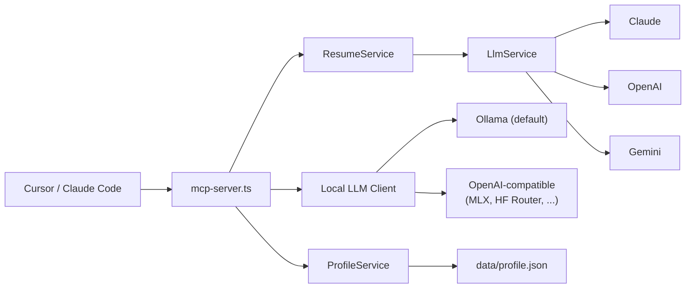

# IT-Resume-MCP

채용 공고(JD)를 입력하면 개인 프로필을 바탕으로 이력서, 포트폴리오 요약본, 자기소개서 초안을 생성하는 로컬 MCP 서버입니다. NestJS 위에 MCP 서버를 올리고, Cloud LLM fallback과 OpenAI-compatible / Ollama 기반 Local LLM 파이프라인을 함께 두는 구조입니다.

포트폴리오 관점에서는 "개인 프로필 JSON을 단일 소스로 관리하고, JD 분석 → 프로필 매칭 → 문서 생성으로 분리된 파이프라인을 MCP tool로 노출했다"는 점이 핵심입니다.

## 현재 상태

- 앱 코드는 `public-resume-mcp/` 아래에 있습니다.
- 2026-04-26 기준 로컬에서 `npm test -- --runInBand`, `npm run build` 통과를 확인했습니다.
- 주 사용 엔트리포인트는 `public-resume-mcp/src/mcp-server.ts` 입니다.
- HTTP API(`src/main.ts`)도 존재하지만, 이 프로젝트의 핵심 사용 시나리오는 MCP 연동입니다.
- 로컬 `origin`은 `git@github.com:doyeonjeong/IT-Resume-MCP.git`로 맞춰졌습니다.

## 저장소 구조

```text
.
├── README.md
├── DEV-PLAN.md
└── public-resume-mcp/
    ├── src/
    │   ├── mcp-server.ts
    │   ├── main.ts
    │   ├── llm/
    │   ├── profile/
    │   ├── resume/
    │   └── utils/
    ├── data/
    │   └── profile.example.json
    ├── documents/
    ├── docs/
    └── package.json
```

## 핵심 기능

- `get_profile`, `update_profile`로 개인 프로필 JSON 관리
- `generate_resume`, `generate_portfolio`, `generate_cover_letter`로 Cloud LLM 기반 문서 생성
- `analyze_jd`, `match_profile_to_jd`, `generate_resume_bullets`, `generate_resume_markdown`로 단계별 생성
- Local LLM provider는 두 가지: `ollama`(기본, 모든 플랫폼) 또는 `openai-compatible`(MLX, Hugging Face Router 등 어떤 OpenAI-호환 endpoint도 가능)
- Claude / OpenAI / Gemini fallback
- 모델은 환경변수로 자유 교체

## 아키텍처



Local LLM 파이프라인:

```text
JD 입력
-> analyze_jd
-> match_profile_to_jd
-> generate_resume_bullets
-> generate_resume_markdown
```

## 기술 스택

| 레이어 | 기술 |
| --- | --- |
| Backend | NestJS 11, TypeScript |
| Protocol | Model Context Protocol SDK |
| Local LLM | Ollama (default), OpenAI-compatible endpoints (MLX, HF Router, ...) |
| Cloud LLM | Claude, OpenAI, Gemini |
| Validation | class-validator, Zod |
| Test | Jest |

## 빠른 실행

```bash
git clone https://github.com/doyeonjeong/IT-Resume-MCP.git
cd IT-Resume-MCP/public-resume-mcp
npm install
cp env.example .env
```

`.env` 예시:

```env
LLM_PROVIDER=gemini
OPENAI_API_KEY=your-openai-api-key-here
ANTHROPIC_API_KEY=your-anthropic-api-key-here
GOOGLE_API_KEY=your-google-api-key-here

# Local LLM provider: ollama (default) | openai-compatible
LOCAL_LLM_PROVIDER=ollama

# Generic local LLM settings (factory applies provider-specific defaults if unset)
# LOCAL_LLM_BASE_URL=http://localhost:11434
# LOCAL_LLM_MODEL=gemma4:26b
# LOCAL_LLM_API_KEY=

LLM_TIMEOUT_MS=120000
```

### Local LLM 백엔드 1 — Ollama (기본, 권장)

모든 OS에서 동작. 처음 시작이라면 이걸 쓰세요.

```bash
brew install ollama          # macOS, 또는 https://ollama.com/download
ollama pull gemma4:26b
ollama serve
```

기본 설정으로 그대로 동작합니다. `.env`의 `LOCAL_LLM_PROVIDER=ollama`만 있으면 됩니다.
다른 모델을 쓰고 싶다면:

```env
LOCAL_LLM_PROVIDER=ollama
LOCAL_LLM_BASE_URL=http://localhost:11434
LOCAL_LLM_MODEL=qwen2.5:14b
```

### Local LLM 백엔드 2 — OpenAI-compatible endpoint

OpenAI Chat Completions API와 호환되는 어떤 endpoint든 붙입니다 (MLX server, Hugging Face Router, vLLM, LM Studio, …).

`.env`:

```env
LOCAL_LLM_PROVIDER=openai-compatible
LOCAL_LLM_BASE_URL=<endpoint /v1>
LOCAL_LLM_MODEL=<model name>
LOCAL_LLM_API_KEY=<token or placeholder>
```

#### Preset A — MLX on Apple Silicon

빠르고 메모리 효율적. Apple Silicon 전용.

```bash
/opt/homebrew/bin/python3.12 -m venv .venv-mlx
.venv-mlx/bin/pip install -U mlx-vlm
.venv-mlx/bin/mlx_vlm.server --model mlx-community/gemma-4-26b-a4b-it-4bit --port 8080
```

`.env`:

```env
LOCAL_LLM_PROVIDER=openai-compatible
LOCAL_LLM_BASE_URL=http://localhost:8080/v1
LOCAL_LLM_MODEL=mlx-community/gemma-4-26b-a4b-it-4bit
LOCAL_LLM_API_KEY=mlx
```

참고: `mlx_vlm.server`가 텍스트 모델도 OpenAI-compatible endpoint로 서빙합니다. 텍스트 전용 빌드를 원하면 `mlx-lm`/`mlx_lm.server`로 교체 가능 (env 변경만 필요).

#### Preset B — Hugging Face Router

```env
LOCAL_LLM_PROVIDER=openai-compatible
LOCAL_LLM_BASE_URL=https://router.huggingface.co/v1
LOCAL_LLM_MODEL=zai-org/GLM-5.1:preferred
LOCAL_LLM_API_KEY=hf_your-token-here
```

권장 시작 모델: `zai-org/GLM-5.1:preferred`, `deepseek-ai/DeepSeek-R1:preferred`. 모델 가용성은 Hugging Face Router 상태에 따라 변동.

프로필 파일 생성:

```bash
cp data/profile.example.json data/profile.json
```

또는 `get_profile` / `update_profile`를 처음 호출하면 `profile.example.json` 기준으로 `data/profile.json`이 자동 생성됩니다.

중요:

- 예시값(`홍길동`, `프로젝트명`, `username/project`)이 남아 있으면 생성 단계에서 `PROFILE_INCOMPLETE` 에러로 막습니다.
- 먼저 `data/profile.json`을 본인 정보로 바꾼 뒤 생성 tool을 호출해야 합니다.

실행:

```bash
npm run build
npm run mcp
```

## MCP 설정 예시

`dist/mcp-server.js`를 직접 실행하도록 등록합니다.

```json
{
  "mcpServers": {
    "resume-mcp": {
      "command": "node",
      "args": [
        "/absolute/path/to/IT-Resume-MCP/public-resume-mcp/dist/mcp-server.js"
      ],
      "env": {
        "LLM_PROVIDER": "gemini",
        "GOOGLE_API_KEY": "your_api_key",
        "LOCAL_LLM_PROVIDER": "ollama",
        "LLM_TIMEOUT_MS": "120000"
      }
    }
  }
}
```

## MCP Tools

| Tool | 설명 |
| --- | --- |
| `get_profile` | 현재 프로필 조회 |
| `update_profile` | 프로필 JSON 부분 업데이트 |
| `generate_resume` | JD 맞춤 이력서 생성 |
| `generate_portfolio` | 포트폴리오 요약본 생성 |
| `generate_cover_letter` | 자기소개서 생성 |
| `analyze_jd` | JD를 구조화 JSON으로 분석 |
| `match_profile_to_jd` | JD와 프로필 매칭 포인트 도출 |
| `generate_resume_bullets` | ATS 친화 bullet 생성 |
| `generate_resume_markdown` | 최종 Markdown 이력서 생성 |

추천 사용 흐름:

1. `get_profile`로 초기 프로필 파일 생성 또는 현재 내용 확인
2. `update_profile` 또는 직접 파일 편집으로 `data/profile.json` 개인화
3. 빠른 1회 생성이 필요하면 `generate_resume`
4. 단계형 제어가 필요하면 `analyze_jd -> match_profile_to_jd -> generate_resume_bullets -> generate_resume_markdown`

## 사용법 시나리오 (Workflow Walkthrough)

이 MCP 서버는 Cursor / Claude Code / Cline 같은 AI IDE에서 도구를 호출하는 방식으로 사용합니다. AI가 도구 이름과 인자를 자동으로 결정하므로, 사용자는 자연어로 의도만 전달하면 됩니다.

### 시나리오 1 — JD 받았을 때 한 번에 이력서 생성

채팅에 채용 공고 텍스트를 붙여넣고 한 줄 요청합니다.

> "이 JD에 맞춰 이력서 만들어줘. 회사명은 ROSAIC. 직무는 LLM 엔지니어."

AI는 자동으로 다음을 호출합니다:

```
generate_resume({
  position: "LLM 엔지니어",
  companyName: "ROSAIC",
  jdText: "<JD 본문 전체>",
  language: "ko"
})
```

**동작 경로:** Cloud LLM (`LLM_PROVIDER` 설정된 provider — Claude/OpenAI/Gemini fallback) 한 번 호출 → 완성된 이력서 markdown 반환.

**언제 쓰나:** 빠른 1회 생성. JD가 짧고 단순할 때.

### 시나리오 2 — 단계별 제어로 정밀 이력서 생성 (권장)

세부 제어가 필요하면 4단계 stepwise 파이프라인:

#### Step 1: JD 분석

> "이 JD부터 분석해줘"

```
analyze_jd({ jdText: "<JD 본문>", language: "ko" })
```

응답 (구조화 JSON):
```json
{
  "roleTitle": "AI x Robotics x Manufacturing AX 엔지니어",
  "companyType": "startup",
  "requiredSkills": ["Python", "Git", "Linux", ...],
  "preferredSkills": ["ROS2", "Isaac Sim", "LLM", ...],
  "responsibilities": ["LLM 기반 제조 AX 솔루션 개발", ...],
  "keywords": ["AI", "Robotics", "Manufacturing AX", ...],
  "seniority": "mid",
  "atsKeywords": ["Python", "LLM", "RAG", ...],
  "riskFactors": ["주니어에게 진입 장벽이 높음", ...]
}
```

#### Step 2: 프로필과 매칭

> "그 분석 결과로 내 프로필이랑 매칭해봐"

```
match_profile_to_jd({ jdAnalysis: <step1 결과>, language: "ko" })
```

응답:
```json
{
  "strongMatches": ["LLM API (Claude, OpenAI, Gemini) 직접 운영 경험"],
  "partialMatches": ["NestJS 백엔드 경험은 풍부하나 Python AI 시스템 개발 경험은 부족"],
  "missingButRecoverable": ["ROS2/Isaac Sim 경험 없음 — 학습 중임을 명시"],
  "doNotOverclaim": ["로보틱스 도메인 실무 경험"],
  "recommendedPositioning": "AI Agent 설계 경험을 제조 AX 영역으로 확장하는 엔지니어"
}
```

#### Step 3: ATS 친화 bullet 생성

> "이걸로 이력서 bullet 뽑아줘"

```
generate_resume_bullets({ jdAnalysis: <step1>, language: "ko", tone: "professional" })
```

응답:
```json
{
  "summary": "...",
  "skills": ["Python", "LLM (Claude, OpenAI, Gemini)", ...],
  "experienceBullets": ["...개선했습니다", ...],
  "projectBullets": ["MCP 기반 AI Agent 서버 구축...", ...],
  "coverLetterHooks": ["귀사의 ROSAIC 미션과 정확히 부합하는...", ...]
}
```

#### Step 4: 최종 Markdown 이력서

> "마크다운으로 정리해줘"

```
generate_resume_markdown({ resumeData: <step3>, template: "ai-agent" })
```

응답: 깨끗한 ATS-friendly markdown 이력서. `# 이름`으로 시작.

**Template 선택:**
- `general` — 표준
- `ios`, `backend`, `fullstack`, `ai-agent` — 강조점에 따라 섹션 구성 변형

### 시나리오 3 — 프로필 관리

#### 첫 사용

```
get_profile()
```

`data/profile.json`이 없으면 `profile.example.json` 기준으로 자동 생성됩니다. 단 placeholder 값(`홍길동`, `프로젝트명`)이 남아있으면 모든 생성 도구가 `PROFILE_INCOMPLETE` 에러로 거부합니다.

#### 부분 업데이트

```
update_profile({
  skills: ["NestJS", "TypeScript", "Python", "MCP SDK", "Claude API"]
})
```

지정한 필드만 갱신, 나머지는 유지.

#### 직접 편집

`data/profile.json`을 텍스트 에디터로 직접 편집해도 됩니다. JSON schema는 위 "프로필 스키마" 섹션 참고.

### 시나리오 4 — 빠른 자기소개서 (1회 호출)

> "이 JD로 ROSAIC 자기소개서 써줘"

```
generate_cover_letter({
  position: "LLM 엔지니어",
  companyName: "ROSAIC",
  jdText: "<JD>",
  language: "ko"
})
```

Cloud LLM이 1,000자 이내 한국어 자기소개서를 STAR 형식으로 작성합니다.

### 실행 시간 참고 (Apple Silicon, Gemma 4 26B via Gemini OpenAI-compatible endpoint)

| 단계 | 평균 |
|---|---|
| `analyze_jd` | 13초 |
| `match_profile_to_jd` | 13초 |
| `generate_resume_bullets` | 20초 |
| `generate_resume_markdown` | 45초 |
| **4단계 총합** | **약 90초** |

`generate_resume`(1회 cloud) 경로는 약 10~20초 (provider 응답 속도에 따라).

## 프로필 스키마

`data/profile.json`은 이 프로젝트의 단일 데이터 소스입니다.

```json
{
  "name": "홍길동",
  "title": "Full-stack Developer",
  "summary": "2년차 풀스택 개발자입니다.",
  "skills": ["NestJS", "TypeScript", "React"],
  "projects": [
    {
      "title": "프로젝트명",
      "period": "2025.01 ~ 2025.06",
      "role": "백엔드 개발",
      "description": "본인의 기여를 사실 기반으로 설명",
      "techStack": ["NestJS", "TypeScript", "PostgreSQL"],
      "achievements": "API 응답 시간 40% 개선",
      "githubUrl": "https://github.com/username/project"
    }
  ]
}
```

## 검증

로컬에서 확인한 명령:

```bash
cd public-resume-mcp
npm test -- --runInBand
npm run build
```

현재 테스트 범위:

- `ResumeService` 프롬프트 조립
- `LlmService` fallback 동작
- MCP tool 입력/출력 스키마 검증
- `ProfileService` 초기 부트스트랩과 placeholder 차단

## 트러블슈팅

- `PROFILE_INCOMPLETE`:
  `data/profile.json`에 예시값이 남아 있습니다. 이름, 프로젝트명, GitHub URL 등을 실제 값으로 바꿔야 합니다.
- `INVALID_LOCAL_LLM_PROVIDER`:
  `.env`의 `LOCAL_LLM_PROVIDER`가 `ollama` 또는 `openai-compatible`이 아닙니다. 오타를 확인하세요.
- `OLLAMA_CONNECTION_FAILED`:
  `ollama serve`가 떠 있는지 확인하고 `LOCAL_LLM_BASE_URL`(또는 기본 `http://localhost:11434`)이 맞는지 점검하세요.
- `LOCAL_LLM_CONNECTION_FAILED`:
  OpenAI-compatible endpoint(예: `mlx_vlm.server`)가 떠 있는지, `LOCAL_LLM_BASE_URL`이 정확한지 확인하세요.
- `LOCAL_LLM_AUTH_FAILED`:
  `LOCAL_LLM_API_KEY`가 없거나 endpoint에서 거부됨. Hugging Face Router면 `hf_` 토큰의 권한 확인.
- `LOCAL_LLM_MODEL_UNAVAILABLE`:
  선택한 모델이 현재 endpoint에서 서빙되지 않습니다. 모델 이름 확인 또는 다른 모델로 교체.
- `LOCAL_LLM_RATE_LIMITED`:
  Hugging Face Router 등 외부 endpoint의 rate limit. 잠시 후 재시도하거나 모델/제공자 변경.
- `No LLM API key found`:
  Cloud 생성 tool을 쓸 때는 `.env`에 `ANTHROPIC_API_KEY`, `OPENAI_API_KEY`, `GOOGLE_API_KEY` 중 최소 하나가 필요합니다.

## 알려진 한계

- 실제 생성 품질은 입력한 `profile.json`의 밀도에 크게 좌우됩니다.
- MCP stdio 레벨 end-to-end 테스트는 아직 없습니다.
- 루트 저장소에 초기 정리가 덜 된 문서와 초안 파일이 남아 있어, 공개 전 추가 정돈이 좋습니다.
- 주 엔트리포인트는 `mcp-server.ts`이며, 다른 실험용 진입점은 포트폴리오 설명에서 제외하는 편이 낫습니다.

## 포트폴리오에 어떻게 설명할지

- MCP 서버로 이력서 생성 기능을 AI IDE에 붙여 실제 워크플로우에 통합한 프로젝트
- JD 분석, 프로필 매칭, 문서 생성 단계를 분리해 tool composability를 만든 프로젝트
- Cloud LLM fallback과 Local LLM 경로를 분리해 비용/개인정보/실행 환경 trade-off를 설계한 프로젝트
- 개인 프로필을 JSON 스키마로 표준화해 반복 가능한 문서 생성 파이프라인을 만든 프로젝트
